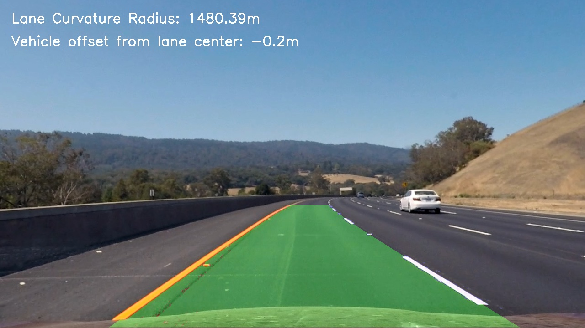

# Project 2: Advanced Lane Lines

Project 2 for Udacity Self-Driving Car Engineer Nanodegree, which involves finding lane lines and their curvature, as well as the car's location with respect to the lane center. To do this, the camera is first calibrated using pictures of chessboard printouts provided for the project. Images are then converted to binary using careful color space and gradient thresholding. Then, the binary images are perspective warped so that we are viewing the road from the top down. From this perspective, we are able to fit polynomial curves to the lines. From these polynomials, we can visualize the lane, as well as determine the lane curvature radius and the vehicle offset from the center of the lane. 

For a more detailed description of each of these steps, see the `writeup.md` file in this repository. The workflow can be observed by following the numbered IPython notebooks.

To use the pipeline, import it into a python file/notebook with `from lane_finder import Lane_Finder`, and follow the docstrings.

Example Frame:

[Link to my video result](./output_images/project_video_output.mp4)

## Contents

- 1_Pipeline_Development.ipynb - the first notebook for the project, which contains all of the workflow involved in developing the components of the pipeline, including calibration, perspective transformation, and polynomial fitting. A class object is drafted to fulfill these pipeline steps, and then tested on the project videos.
- 2_Pipeline_Refinement.ipynb - the second notebook for the project, where the pipeline class object is refined for better functionality, and attempts are made to expand its abilities to handle the challenge videos. Comments on possible future improvements are made.
- writeup.md - my write up for the project.
- lane_finder.py - file which contains the code of the refined pipeline.
- output_images/ - folder containing all of the output images and videos from the pipeline.
- camera_cal/ - folder containing the calibration files for the camera.
- test_images/ - folder containing test images for the project.
- examples/ - folder containg example outputs provided for the project.