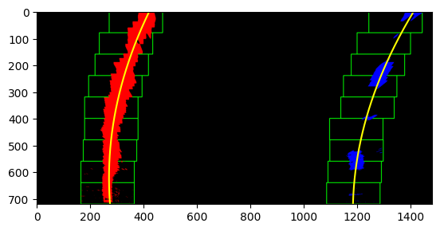

## Project 2 Writeup

### Nate Cibik - 04/2021

---

**Advanced Lane Finding Project**

The goals / steps of this project are the following:

* Compute the camera calibration matrix and distortion coefficients given a set of chessboard images.
* Apply a distortion correction to raw images.
* Use color transforms, gradients, etc., to create a thresholded binary image.
* Apply a perspective transform to rectify binary image ("birds-eye view").
* Detect lane pixels and fit to find the lane boundary.
* Determine the curvature of the lane and vehicle position with respect to center.
* Warp the detected lane boundaries back onto the original image.
* Output visual display of the lane boundaries and numerical estimation of lane curvature and vehicle position.

## [Rubric](https://review.udacity.com/#!/rubrics/571/view) Points

### Here I will consider the rubric points individually and describe how I addressed each point in my implementation.  

---

### Camera Calibration

#### 1. Briefly state how you computed the camera matrix and distortion coefficients. Provide an example of a distortion corrected calibration image.

The walkthrough of the process for this step is contained in the first section of the '[1_Pipeline_Development.ipynb](1_Pipeline_Development.ipynb)' IPython notebook. The workflow is also incorporated into the main lane finding class object called `Lane_Finder` located in '[lane_finder.py](lane_finder.py)'.

I start by preparing "object points", which will be the (x, y, z) coordinates of the chessboard corners in the world. Here I am assuming the chessboard is fixed on the (x, y) plane at z=0, such that the object points are the same for each calibration image.  Thus, `objp` is just a replicated array of coordinates, and `objpoints` will be appended with a copy of it every time I successfully detect all chessboard corners in a test image.  `imgpoints` will be appended with the (x, y) pixel position of each of the corners in the image plane with each successful chessboard detection.  

I then used the output `objpoints` and `imgpoints` to compute the camera calibration and distortion coefficients using the `cv2.calibrateCamera()` function.  I applied this distortion correction to a chessboard image using the `cv2.undistort()` function and obtained this result: 


### Pipeline (single images)

#### 1. Provide an example of a distortion-corrected image.

To apply the undistortion to the images, this is the process I followed:

```python
# Applying undistortion to a test image:
# Read in image
test_img = plt.imread('test_images/test1.jpg')
# Undistort the image
undist = cv2.undistort(test_img, mtx, dist, None, mtx)
# Plot the image
plt.imshow(undist)
plt.show()
# Reverse RGB channels and use cv2.imwrite() to save to output_images folder
cv2.imwrite('output_images/undistorted_test_output.jpg', undist[:, :, ::-1])
```

Which yields the following result:


#### 2. Describe how (and identify where in your code) you used color transforms, gradients or other methods to create a thresholded binary image.  Provide an example of a binary image result.

I used a combination of color and gradient thresholds to generate a binary image. A walkthrough of the process can be found in the 'Color and Gradient Thresholding' section of the '[1_Pipeline_Development.ipynb](1_Pipeline_Development.ipynb)' notebook. The final version of the functionality can be found in the in the `binary_lane_image()` method of the lane finding class object located in '[lane_finder.py](lane_finder.py)' starting on line 165. Here's an example of my output for this step.


#### 3. Describe how (and identify where in your code) you performed a perspective transform and provide an example of a transformed image.

The walkthrough of my process for perspective transforming the images can be found in the 'Perspective Transformation' section of the '[1_Pipeline_Development.ipynb](1_Pipeline_Development.ipynb)' notebook. This functionality is built into the `process_image()` method of the pipeline class object found in the `lane_finder.py` file which starts on line 452. The transformation serves to change the perspective to a top-down "bird's eye" view of the lane from which curvature and vehicle position can be determined. 

The `src` and `dst` points for perspective transformation can be explicitly passed into the instantiation of the class object by the user (if applying pipeline to a new video), otherwise they will take the default values shown below, which were devised in the notebook section mentioned above to work well with the videos provided for this project.

```python
src = np.array([[208, imheight], [595, 450],
                [686, 450], [1102, imheight]],
               np.float32)
               
dst = np.array([[208, imheight], [208, 0],
                [1102, 0], [1102, imheight]],
               np.float32)
```

This resulted in the following source and destination points (x, y):

| Source        | Destination   | 
|:-------------:|:-------------:| 
| 208, 720      | 208, 720      | 
| 595, 450      | 208, 0        |
| 686, 450      | 1102, 0       |
| 1102, 720     | 1102, 720     |

I verified that my perspective transform was working as expected by drawing the `src` and `dst` points onto a test image and its warped counterpart to verify that the lines appear parallel in the warped image. Below, we can see both of the provided "straight_lines" images warped using these `src` and `dst` points, with the lines connecting the destination points drawn on. Notice that the chosen points are a happy medium between the two images, the first of which tapers inward slightly, and the second which tapers outward slightly after the transformation.


*NOTE* In the actual pipeline, the destination points are shifted to the right according to a padding value, so that extra space is created on the left side of the resulting image where the left lane can be found in the instance it has pronounced leftward curvature that takes it off the original image plane. The explanation for this process is found in the "Color and Gradient Thresholding" section of the '[1_Pipeline_Development.ipynb](1_Pipeline_Development.ipynb)' notebook.

#### 4. Describe how (and identify where in your code) you identified lane-line pixels and fit their positions with a polynomial?

The workflow for identifying lane-line pixels using the sliding window approach, and then fitting polynomial curves to these pixels can be found in the 'Fitting Polynomial Curves' section of the '[1_Pipeline_Development.ipynb](1_Pipeline_Development.ipynb)' notebook. The sliding window process can be seen in the `find_lane_pixels()` class method in `land_finder.py` starting on line 241. In the full pipeline, the sliding window approach (by default) is only used on the first frame when processing a video, after which the pipeline searches for lane pixels using the previous polynomial curve fit. The code describing this process can be found in the `search_around_poly()` class method starting on line 318 of `lane_finder.py`. If the user sets `always_windows=True` when instantiating the pipeline class object or afterward, the sliding window approach will be used on every frame, which may help preventing runaway curves in certain scenarios.

Once lane pixels are identified, second-order polynomial curves are fit to them. The code which performs this is found in the `fit_polynomial()` method starting on line 381 of `lane_finder.py`. This method will automatically average the curves of previous frames when processing video, according to the `frame_buffer` instance variable which defaults to 5 frames.

Below we can see an example output of finding lane pixels with the sliding window approach, then fitting polynomial curves to them. Notice that 200px of padding has been added to both sides of the warped image, which allows the right lane to be fully visible.



#### 5. Describe how (and identify where in your code) you calculated the radius of curvature of the lane and the position of the vehicle with respect to center.

This is done in lines 439 through 447 in my code in the `lane_finder.py` file in the class method `calc_curvature()`. It is done by evaluating the curvature of the second-order polynomial curves fit for both lane lines at the metric equivalent of the pixel value at the bottom of the image. These two curvatures are averaged together to get the curvature of the lane.

#### 6. Provide an example image of your result plotted back down onto the road such that the lane area is identified clearly.

I implemented this step in lines 513 through 527 in the `lane_finder.py` file in the `process_image()` class method.  Here is an example of my result on a test image:


---

### Pipeline (video)

#### 1. Provide a link to your final video output.  Your pipeline should perform reasonably well on the entire project video (wobbly lines are ok but no catastrophic failures that would cause the car to drive off the road!).

Here's a [link to my video result](./output_images/project_video_output.mp4)

---

### Discussion

#### 1. Briefly discuss any problems / issues you faced in your implementation of this project.  Where will your pipeline likely fail?  What could you do to make it more robust?

Here I'll talk about the approach I took, what techniques I used, what worked and why, where the pipeline might fail and how I might improve it if I were going to pursue this project further.

In this pipeline, camera frames are undistorted using a camera intrinsic matrix and distortion coefficients generated by finding corners in images of chessboards with OpenCV using the `findChessboardCorners()`, `calibrateCamera()`, and `undistort()` functions. These undistorted frames are converted to binary images by using color space and value gradient thresholding, then perspective warped using `warpPerspective()` so that the road is being viewed from the top-down. From this perspective, a sliding window approach is first used to find concentrations of pixels which are likely to contain lane markings, then second-order polynomials are fit using `np.polyfit()` to these pixels with the x as a function of y. These polynomial fits are then used to estimate the curvature of the lane at the position of the car, the position of the car relative to lane center, to visualize the lane in green, and also as search criteria for the lane markings in the next frame when processing video.

For the [project video](./output_images/project_video_output.mp4), the pipeline works quite well, and creates a smooth and accurate lane estimation for all frames. For the [challenge video](./output_images/challenge_video_output_1.mp4), however, it runs into problems because of a split in the lane pavement which causes the pipeline to fail to find the lane markings, instead finding the line in the pavement, and irreversibly throwing off the pipeline's ability to locate the lane markings. An attempt was made to adjust the thresholds to prevent this, by adjusting thresholds and using only the sliding window approach, but success was not achieved. The result of these attempts can be seen [here](./output_images/challenge_video_output_2.mp4). In order to make the pipeline robust against this issue, it would likely help to create constraints for what polynomials are considered an appropriate fit to the sides of the lane. If the polynomial fits then did not meet the acceptance criteria, they would be thrown out and substituted in some way. These acceptance criteria could include ensuring that the left-hand side polynomial is indeed to the left of the right-hand side polynomial by calculating the x positions at the bottom of the image. It would also likely be beneficial to track the similarity and extremity of curvature for both fits, and ignore any fits with unrealistic curvature, favoring a offset version of the better-fitting side by a given lane width for a temporary replacement. The polynomial fits could also be constrained to only being accepted if the lines are on the appropriate side of the image, but this would mean that the pipeline may not generalize into a lane-change/splitting scenario, and further consideration would be needed. All of these points could be tested in future work.

One further observation about the pipeline is that (at least on my machine) it does not operate in real time. This could possibly be fixed by running the code in C++ rather than Python, or looking into other methods of optimization in Python such as possibly Cython or Numba.